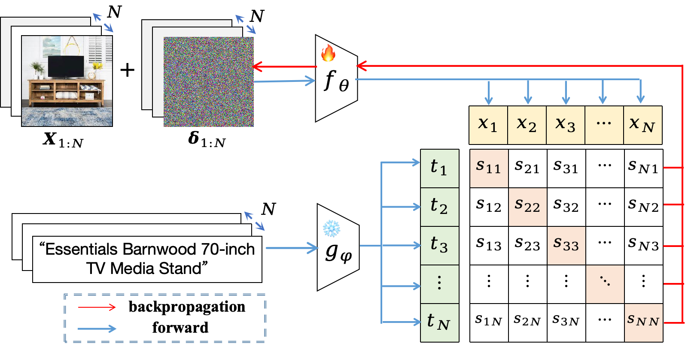

<div align="center">


<h1>Finetune Like You Pretrain: Boosting Zero-shot Adversarial Robustness in Vision-language Models</h1>

Songlong Xing<sup>1</sup> · Weijie Wang<sup>1,2</sup> · 
[Zhengyu Zhao](https://zhengyuzhao.github.io/)<sup>3</sup> · 
[Jindong Gu](https://jindonggu.github.io/)<sup>4</sup> · 
[Philip Torr](https://eng.ox.ac.uk/people/philip-torr)<sup>4</sup> · 
[Nicu Sebe](https://disi.unitn.it/~sebe/)<sup>1</sup>

<sup>1</sup>University of Trento &nbsp;|&nbsp; <sup>2</sup>Fondazione Bruno Kessler &nbsp;|&nbsp; <sup>3</sup>Xi'an Jiaotong University &nbsp;|&nbsp; <sup>4</sup>University of Oxford

<a href="http://arxiv.org/abs/2604.11576"></a>



Figure 1: Overview of our AdvFLYP paradigm.

</div>

## Table of Contents

- [To-do](#-to-do)
- [Abstract](#abstract)
- [Software Requirements](#software-requirements)
- [Dataset Preparation](#dataset-preparation)
- [Implementation](#implementation)
  - [1. Training (Adversarial Finetuning)](#training-adversarial-finetuning)
  - [2. Evaluation](#evaluation)
- [Citation](#citation)
- [Acknowledgement](#acknowledgement)

## 🚧 To-Do

- [x] Release code
- [x] Release dataset
- [x] Add training/eval scripts
- [x] Add README
- [ ] Provide model checkpoints (coming soon)

## Abstract

Despite their impressive zero-shot abilities, vision-language models such as CLIP have been shown to be susceptible to adversarial attacks. To enhance its adversarial robustness, recent studies finetune the pretrained vision encoder of CLIP with adversarial examples on a proxy dataset such as ImageNet by aligning adversarial images with correct class labels. However, these methods overlook the important roles of training data distributions and learning objectives, resulting in reduced zero-shot capabilities and limited transferability of robustness across domains and datasets. 

In this work, we propose a simple yet effective paradigm AdvFLYP, which follows the training recipe of CLIP's pretraining process when performing adversarial finetuning to the model. Specifically, AdvFLYP finetunes CLIP with adversarial images created based on image-text pairs collected from the web, and match them with their corresponding texts via a contrastive loss. To alleviate distortion of adversarial image embeddings of noisy web images, we further propose to regularise AdvFLYP by penalising deviation of adversarial image features. We show that logit- and feature-level regularisation terms benefit robustness and clean accuracy, respectively. 

Extensive experiments on 14 downstream datasets spanning various domains show the superiority of our paradigm over mainstream practices. We release our implementations and model weights here. 

## Software Requirements

We use `conda` to prepare our environment. Please make sure you have conda installed and use the following commands to get the env ready!
```bash
conda env create -f ./env/environment.yml
conda activate AdvFLYP
pip install torch==2.5.1 torchvision==0.20.1 --index-url https://download.pytorch.org/whl/cu121
pip install -r ./env/requirements.txt
```

## Dataset Preparation

We keep all raw data in the folder `./data`.

### Evaluation Data

Please download and unzip all datasets for evaluation into this folder. Running the evaluation script will automatically download most of them. 

### Training Data

For adversarially finetuning CLIP, we employ one million image-text pairs collected from the web. To this end, we randomly sample 1M data from [LAION-400M](https://laion.ai/projects/) with reachable URLs. 
The training web data that we use can be downloaded from this [Google Drive link](https://drive.google.com/file/d/1wWWQxYzoQIwcz0C3b2umpVs2V97xWS-P/view?usp=sharing) (29GB).
Please run the following command to download the web data that we collected.
```bash
python download_data.py
```
Unzip the file `LAION_small.tar.gz`, and you will get the training data folder `./data/laion_samples_small/part0...part9`. The training data is divided into 10 partitions (subfolders) named from `part0` to `part9`, each containing 100k data. Each subfolder contains two child subfolders `partX/images` and `partX/captions`, which contain images and texts, respectively. Within each partition (subfolder) `partX`, an image and a text that share the same filename form a positive pair.
For instance, `data/laion_samples_small/part0/images/000001.jpg` and `data/laion_samples_small/part0/captions/000001.txt` are one matching pair.

We also provide at [this link](https://drive.google.com/file/d/15CVV9GhouCSBoa70L_Z2U_MFmrCe-XHE/view?usp=drive_link) (132MB) a JSON file `laion_index.json` that contains paths to the images and texts for faster data loading. It is recommended to download this file and place it under the training data folder `data/laion_samples_small`.
You can use the following command to download this file:
```bash
python -c "url='https://drive.google.com/uc?id=1l1RH6xeNcFCIUvdFWxWjZT79QB3uIasT'; output='./data/laion_samples_small/laion_index.json'; import gdown; gdown.download(url, output, quiet=False)"
```

**Expected Directory Structure:**

```text
data/
├──laion_samples_small/
│    ├── laion_index.json
│    ├── part0/
│    │   ├── captions/
│    │   │    ├── 000000.txt
│    │   │    ├── ...
│    │   │    ├── 099999.txt
│    │   └── images/
│    │        ├── 000000.jpg
│    │        ├── ...
│    │        └── 099999.jpg
│    ├── ...
│    └── part9/
├── ...
```

## Implementation


### Training (Adversarial finetuning)

To implement AdvFLYP with logit- and feature-level regularisation , use the following command:

```bash

REG_METHOD=(logit feat) # Leave it blank, i.e., REG_METHOD=(), to perform AdvFLYP without regularisation
python -m code.main \
    --root ./data \
    --batch_size 256 --epochs 100 --patience 10 --learning_rate 1e-4 \
    --dataset smallLAION --n_data 1000000 \
    --reg_level "${REG_METHOD[@]}" --lambda_feat 1.0 --lambda_logit 1.0 \
    --model_dir ./save_AdvFLYP --name AdvFLYP_full \
    --train_attack_type pgd --train_eps 1.0 --train_numsteps 2 --train_stepsize 1 \
    --eval_set tinyImageNet --test_attack_type pgd --test_eps 1.0 --test_numsteps 10 --test_stepsize 1
```

This process will be terminated either when the target model's robustness has not improved for a maximum number of epochs `--patience` or when the maximum number of epochs `--epochs` is reached. The model checkpoints will be saved under the the folder specified by `--model_dir`.

Feel free to adjust the arguments to implement AdvFLYP under different training settings. You can also directly edit `train.sh` and run `bash scripts/train.sh`.

#### Argument description: ####

| Argument | Description |
| --- | --- |
| --root | Root path to raw data (for training and evaluation). Specify your path to `./AdvFLYP/data` |
| --batch_size | Batch size during AFT (256).|
| --epochs | Number of epochs (100). |
| --patience | Number of epochs without improvement before halting (10). |
| --learning_rate | Learning rate (1e-4). |
| --dataset | Data on which to finetune CLIP (`smallLAION`). |
| --n_data | Number of training data to use (1000000). |
| --reg_level | Regularisation level (`[logit feat]`). |
| --lambda_feat | Regularisation weight for feature level (1.0) |
| --lambda_logit | Regularisation weight for logit level (1.0) |
| --model_dir | Directory to save checkpoints into (`./save_AdvFLYP`). Will be created if not already existing. |
| --name | A tag for the checkpoints during the current run (`AdvFLYP_full`). |
| --train_attack_type | Attack method during finetuning (`pgd`). |
| --train_eps | Attack strength during finetuning (1.0). Will be divided by 256 in the run. |
| --train_numsteps | Number of iterative steps for creating adversarial attacks during finetuning (2). |
| --train_stepsize | Stepsize when creating adversarial perturbations during finetuning (1.0). Will be divided by 256 in the run. |
| --eval_set | Evaluation set after each epoch (`tinyImageNet`). |
| --test_attack_type | Attack method during evaluation (`pgd`). |
| --test_eps | Attack strength during evaluation (1.0). Will be divided by 256 in the run. |
| --test_numsteps | Number of iterative steps for creating adversarial attacks during evaluation (10). |
| --train_stepsize | Stepsize when creating adversarial perturbations during evaluation (1.0). Will be divided by 256 in the run. |

### Evaluation

After adversarial finetuning, use the following command to evaluate the finetuned model:

```bash
TEST_MODEL_PATH=./save_AdvFLYP/CHECKPOINT.pth.tar # Specify the path to the finetuned checkpoints.
TEST_SET=(cifar10 cifar100 STL10 Caltech101 Caltech256 oxfordpet flowers102 Food101 StanfordCars SUN397 Country211 fgvc_aircraft EuroSAT dtd) # 14 datasets
python -m code.main \
    --evaluate \
    --root ./data
    --resume $TEST_MODEL_PATH --test_set "${TEST_SET[@]}" \
    --batch_size 256 \
    --test_attack_type pgd --test_eps 1 --test_numsteps 10 --test_stepsize 1
```
Alternatively, directly run `bash scripts/test.sh` under the project folder.

#### Argument description: ####

| Argument | Description |
| --- | --- |
| --evaluation | Evaluation mode. |
| --root | Root path to raw data (for training and evaluation). Specify your path to `./AdvFLYP/data` 
| --resume | Path to the model checkpoint to be evaluated. Defaults to the original CLIP if not specified. |
| --test_set | A list of datasets on which to evaluate the model. |
| --batch_size | Batch size during evaluation (256).|
| --test_attack_type | Attack method during evaluation (`pgd`). |
| --test_eps | Attack strength during evaluation (1.0). Will be divided by 256 in the run. |
| --test_numsteps | Number of iterative steps for creating adversarial attacks during evaluation (10). |
| --train_stepsize | Stepsize when creating adversarial perturbations during evaluation (1.0). Will be divided by 256 in the run. |


## Citation

If you find this repo useful, please cite our work:

```
@article{xing2026finetune,
  title={Finetune Like You Pretrain: Boosting Zero-shot Adversarial Robustness in Vision-language Models},
  author={Xing, Songlong and Wang, Weijie and Zhao, Zhengyu and Gu, Jindong and Torr, Philip and Sebe, Nicu},
  journal={arXiv preprint arXiv:2212.07016},
  year={2026}
}
```

## Acknowledgement

Our code is developed based on the open-sourced code of [TeCoA](https://github.com/cvlab-columbia/ZSRobust4FoundationModel). We thank the authors for their work. Please also consider citing their paper:

```
@inproceedings{maounderstanding,
  title={Understanding Zero-shot Adversarial Robustness for Large-Scale Models},
  author={Mao, Chengzhi and Geng, Scott and Yang, Junfeng and Wang, Xin and Vondrick, Carl},
  booktitle={The Eleventh International Conference on Learning Representations},
  year={2023}
}
```
